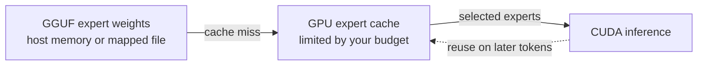

# llama.cpp with MoE expert caching

Run large mixture-of-experts (MoE) models with a GPU cache for the experts they use most. This is a maintained [llama.cpp](https://github.com/ggml-org/llama.cpp) fork focused on running models whose expert weights exceed GPU memory.

**CUDA only for the expert cache.** The rest of llama.cpp's models and backends remain available. The cache is off unless you enable it.

[Get started](#get-started) · [How it works](#how-it-works) · [Options](#choose-a-cache-budget) · [Documentation](#documentation)

## Why use this fork?

A MoE model has many small expert networks but selects only a few for each token. Keeping every expert on the GPU can require more VRAM than a local machine has. This fork keeps a configurable set of experts on the GPU and loads others from host memory when needed.

| You can | What it means |
| --- | --- |
| Set a GPU cache budget | Choose how much VRAM to reserve for routed experts on each CUDA device. |
| Keep large models usable | Run with expert weights backed by host memory, including memory-mapped GGUF files. You still need enough system memory and storage for the model and workload. |
| Use familiar llama.cpp tools | Serve a local chat UI and API with `llama-server`, or use the other tools built from this fork. |
| Start with standard behavior | Omit the cache flag to use the normal llama.cpp path. |

Cache performance depends on the model, quantization, available VRAM, host memory, storage, and request pattern. A larger cache can reduce transfers, but its best size is workload specific.

## How it works



The model selects experts for each token. Experts already in the GPU cache are reused; missing experts are brought in from their host backing. The cache changes where expert weights are kept, not which experts the model selects. Eligible decode workloads can also use the fork's grouped CUDA path automatically. See the [feature guide](docs/fork-features.md) for eligibility and fallback details.

## Get started

You need an NVIDIA GPU, a working CUDA toolkit and driver, CMake, and a MoE model in GGUF format. The model's disk, RAM, and VRAM requirements vary. Build this fork from source and supply a compatible model.

1. Clone and build this fork with CUDA:

   ```sh
   git clone --branch moe-cache https://github.com/GenerelSchwerz/llama.cpp.git
   cd llama.cpp
   cmake -B build -DGGML_CUDA=ON -DCMAKE_BUILD_TYPE=Release
   cmake --build build --config Release -j
   ```

2. Start the server with your GGUF model and a GPU cache budget:

   ```sh
   ./build/bin/llama-server -m /path/to/model.gguf --moe-expert-cache-mib 4096
   ```

3. Open the local address printed by the server to chat, or connect an OpenAI-compatible client to its API.

`4096` is an example budget in MiB, not a recommended size for every GPU or model. Leave room for non-expert weights, context, and runtime buffers. If the model does not fit, lower the cache budget or adjust model placement and context size. For build variants and server settings, use the [build guide](docs/build.md#cuda) and [server guide](tools/server/README.md).

## Choose a cache budget

| Control | Use it for |
| --- | --- |
| `--moe-expert-cache-mib MiB` | Set a VRAM budget per CUDA device. A single value applies to each selected device. |
| `--moe-expert-cache-size N` | Set the number of expert slots per cached tensor instead of a MiB budget. |
| `--moe-expert-cache-layers N[,N-M,...]` | Limit caching to selected MoE layers. |
| `--moe-expert-cache-host-pinned-mb N` | Bound host memory registration and staging. The default tries full pinning, then falls back where needed. |

Use **either** `--moe-expert-cache-mib` **or** a nonzero `--moe-expert-cache-size`. Both cache controls are off by default. For separate speculative draft models, multi-GPU placement, host memory behavior, and exact defaults, see the [feature guide](docs/fork-features.md).

To check that the cache actually ran, make a request and look for `moe-cache` hit/miss statistics in the server log. A startup flag or GPU layer count alone does not establish that the cache was active. Detailed diagnostics are available with `--experimental-logs`.

## Documentation

- [Fork features and limitations](docs/fork-features.md) - full cache controls, placement, grouped decode, and speculative draft behavior.
- [Build llama.cpp](docs/build.md) - CUDA and other backend builds.
- [Run the server](tools/server/README.md) - chat UI, API, and server options.
- [Multi-GPU](docs/moe-grouped-multigpu.md) - cache ownership and validation notes. The cache supports layer split; tensor split with the cache enabled is unsupported.

## Work with me or support the project

I'm looking for a job in GPU inference, systems engineering, or local AI based on the work in this fork. If that matches your team, reach out through my [GitHub profile](https://github.com/GenerelSchwerz).

If this work helps you, you can [support me on Ko-fi](https://ko-fi.com/generel).

## Credits and license

This project builds on [llama.cpp](https://github.com/ggml-org/llama.cpp) and [ggml](https://github.com/ggml-org/ggml). The fork changes and upstream code are available under the repository's [MIT license](LICENSE). Model files have their own licenses.
