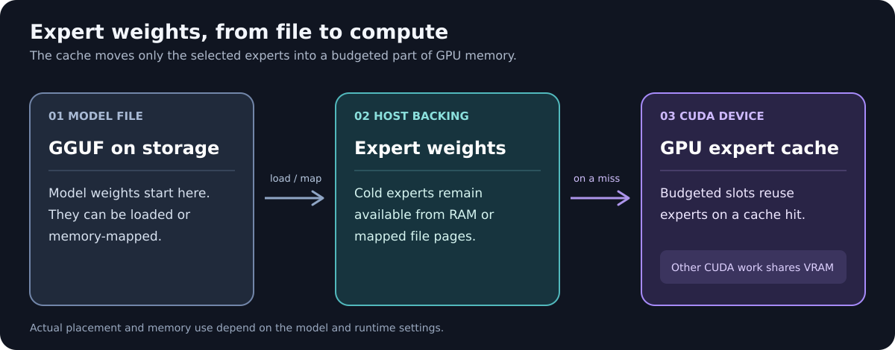

<h1 align="center">MoE Cache for llama.cpp</h1>

<p align="center"><strong>A CUDA expert tier for GGUF mixture-of-experts models.</strong><br>
Keep frequently used experts on your GPU while other expert weights stay in host memory.</p>

> [!TIP]
> **New here? Start with the [MoE Cache wiki guide](https://github.com/GenerelSchwerz/llama.cpp/wiki/MoE-Cache).** It covers the build, setup, and limits. From there, choose a [hardware guide](https://github.com/GenerelSchwerz/llama.cpp/wiki/Hardware-Setup-Guides), follow the [Windows WDDM instructions](https://github.com/GenerelSchwerz/llama.cpp/wiki/Windows-WDDM-Partial-Pinning), or use the [Docker Compose guide](https://github.com/GenerelSchwerz/llama.cpp/wiki/Docker-Compose-for-Large-MoE-Models).



This maintained [llama.cpp](https://github.com/ggml-org/llama.cpp) fork adds an **opt-in expert cache** for MoE models whose expert weights exceed VRAM. It keeps the familiar llama.cpp server and API. Without a cache flag, normal llama.cpp model placement remains available.

> **NVIDIA CUDA only today.** The MoE cache requires an NVIDIA GPU. Have an AMD GPU or another system with separate RAM and VRAM? Join the [OptLlama Discord](https://discord.gg/ZWD8TbHXxs) to discuss support.

## What this branch adds

- **Budgeted expert caching:** choose VRAM per device or a slot count; cold expert weights stay host-backed.
- **Automatic fast paths:** compatible workloads can use grouped CUDA decode, cached prefill, and expert prefetch.
- **Memory and drafting controls:** bound host pinning and configure a separately loaded speculative draft model independently.

The [feature guide](docs/fork-features.md) lists eligibility, defaults, and fallback behavior.

## Measured results

Selected single-request decode results from the [full benchmark comparison](https://github.com/GenerelSchwerz/llama.cpp/wiki/Benchmark-Comparison-Showcase):

| Model | Stock llama.cpp | MoE cache fork | Peak VRAM difference |
| --- | ---: | ---: | ---: |
| Qwen3.6 35B | 42.8 tok/s | 111.6 tok/s | -3.2% |
| Gemma 4 | 34.2 tok/s | 102.2 tok/s | +3.4% |
| Nemotron 3.5 Lightning | 57.0 tok/s | 114.9 tok/s | +0.1% |
| Ornith 1.5 | 35.2 tok/s | 97.4 tok/s | -2.3% |

Measured on an RTX 5070 Ti 16 GB with about 62 GiB RAM. Each pair was within 5% peak VRAM. These are selected historical results, not measurements of the current branch head or predictions for another machine. The [wiki benchmark suite](https://github.com/GenerelSchwerz/llama.cpp/wiki/Benchmark-Comparison-Showcase) includes regressions, tested revisions, quantizations, exact commands, output notes, and other models.

## Run it

This is the shortest source-build path. For a measured setup with model-specific placement, start in the [wiki](https://github.com/GenerelSchwerz/llama.cpp/wiki/MoE-Cache).

Build the `moe-cache` branch with an NVIDIA CUDA toolkit and CMake:

```sh
git clone --branch moe-cache https://github.com/GenerelSchwerz/llama.cpp.git
cd llama.cpp
cmake -B build -DGGML_CUDA=ON -DCMAKE_BUILD_TYPE=Release
cmake --build build --config Release -j
```

Start the server with a MoE GGUF you already have:

```sh
./build/bin/llama-server -m /path/to/model.gguf --moe-expert-cache-mib 4096
```

Open the local address printed by the server for chat, or connect an OpenAI-compatible client. The `4096` MiB budget is only an example. Leave VRAM for the rest of the model, context, and runtime buffers.

The model, quantization, context, and placement determine the memory required. The cache changes where routed expert weights live; it does not change which experts the model selects.

## Tune the cache

| Flag | Purpose |
| --- | --- |
| `--moe-expert-cache-mib MiB` | Set the expert cache budget per CUDA device. |
| `--moe-expert-cache-size N` | Choose a slot count per cached tensor instead of a MiB budget. |
| `--moe-expert-cache-layers N[,N-M,...]` | Limit caching to selected MoE layers. |
| `--moe-expert-cache-host-pinned-mb N` | Bound host memory registration and staging. |

Use a MiB budget **or** a nonzero slot count. Both are off by default. Eligible decode workloads can use the fork's grouped CUDA path automatically; the [feature guide](docs/fork-features.md) explains when it applies.

**Check the result:** after a request, look for `moe-cache` hit and miss statistics in the server log. The command line alone does not prove the cache ran. Performance depends on the model, available memory, storage, and request pattern.

## Guides

- [Fork features and limits](docs/fork-features.md) - defaults, host memory, grouped decode, and speculative drafts.
- [Build with CUDA](docs/build.md#cuda) and [use the server](tools/server/README.md).
- [Multi-GPU behavior](docs/moe-grouped-multigpu.md) - layer-split cache placement and validation. Tensor split with the cache enabled is unsupported.
- [Benchmark suite](https://github.com/GenerelSchwerz/llama.cpp/wiki/Benchmark-Comparison-Showcase) - stock versus fork measurements and per-model reproduction records.

## Open to opportunities

I'm a recent computer science graduate interested in AI development (especially local AI), low-level programming, and embedded systems. If your team is hiring in these areas, [email me](mailto:rocco.generel@gmail.com). If this fork has been useful, you can [support my work on Ko-fi](https://ko-fi.com/generel).

## References

- Built on [llama.cpp](https://github.com/ggml-org/llama.cpp) and [ggml](https://github.com/ggml-org/ggml).
- Code is under the repository's [MIT license](LICENSE); model files have their own licenses.
